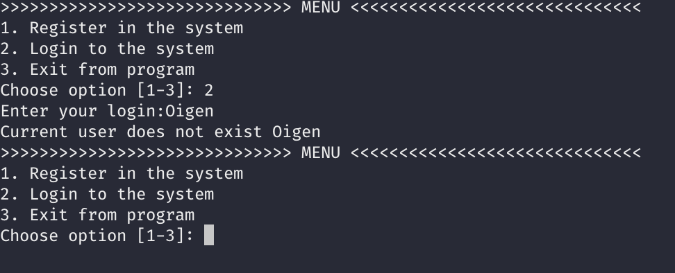
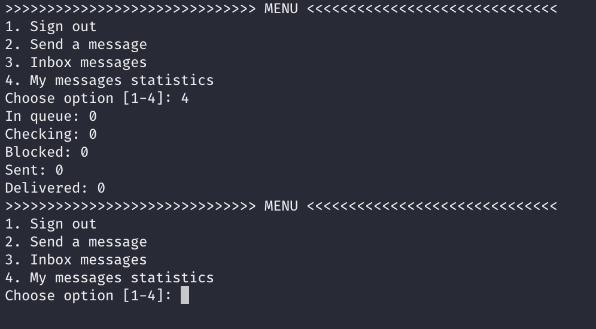

# Лабораторна робота No 2. Практика використання серверу Redis

## ЛР Виконав

Заяць Євген Євгенович, студент групи КП-73

## Завдання

[Посилання на завдання](http://scs.kpi.ua/sites/default/files/lab2_bd2-db2019_2020.pdf)

## Структура даних

Повідомлення зберігаються у вигляді Hash таблиці. Причиною вибору Hash є те, що цей тип даних дозволяє зберегти ключ та значення, що було використано для зберігання інформації про ім'я користувача-відправника, користувача-отримувача, а також власне текст повідомлення. Ключем виступає ідентифікатор повідомлення, що для кожного нового запису оновлюється інкрементно.

Користувачі системи зберігаються у вигляді структури даних Set. Для зберігання користувачів не важливий порядок, але важлива швидкість доступу. Set надає подібні можливості.

В той час як для користувачів ми обрали структуру Set, для черги повідомлень використувоється структура List, так як у данному випадку необхідно зберегти порядок доданих записів. Також важливо помітити, що операції по вилученню та вставці елементів у кінець та початок списку проходять за 1 одиницю часу.

## Приклади роботи програми (користувацька та адмінська панелі)

